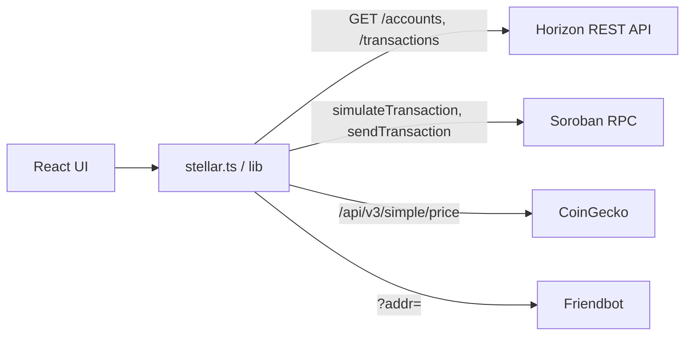

# API Reference

The Stellar Dev Dashboard integrates with four external APIs. This reference documents every endpoint, parameter, request shape, and response structure used by the dashboard.

## Architecture



## Base URLs

```
Horizon Testnet:  https://horizon-testnet.stellar.org
Horizon Mainnet:  https://horizon.stellar.org
Soroban Testnet:  https://soroban-testnet.stellar.org
CoinGecko:        https://api.coingecko.com
Friendbot:        https://friendbot.stellar.org
```

## OpenAPI Specification

The complete machine-readable spec is at [`docs/api/openapi.yaml`](https://github.com/damiedee96/stellar-dev-dashboard/blob/master/docs/api/openapi.yaml).

You can load it into any OpenAPI-compatible tool (Postman, Insomnia, Stoplight) for interactive testing.

## Common conventions

### Amounts

All XLM and asset amounts are **strings** (e.g. `"100.0000000"`) to avoid IEEE-754 floating point loss. The Stellar network uses 7 decimal places (1 XLM = 10,000,000 stroops).

### Pagination (Horizon)

Horizon uses cursor-based pagination via `cursor`, `limit`, and `order` query parameters.

```
GET /accounts/{id}/transactions?limit=20&order=desc&cursor=<cursor>
```

Response includes `_links.next.href` and `_links.prev.href` for navigation.

### Soroban RPC format

Soroban RPC uses **JSON-RPC 2.0** over HTTP POST. Every request requires:

```json
{
  "jsonrpc": "2.0",
  "id": "unique-request-id",
  "method": "methodName",
  "params": { ... }
}
```

### Error format

See the [Error Reference](./error-reference) for the full mapping of HTTP status codes to application error categories.

## Rate limits

| Endpoint | Limit | Priority |
|---|---|---|
| `/accounts` | 20 req/min | High |
| `/transactions` | 15 req/min | Medium |
| `/operations` | 25 req/min | Medium |
| `/assets` | 10 req/min | Low |
| Soroban `/contracts` | 5 req/min | High |
| Default | 30 req/min | Medium |

See [Rate Limiting](./rate-limiting) for the full token-bucket implementation details.
