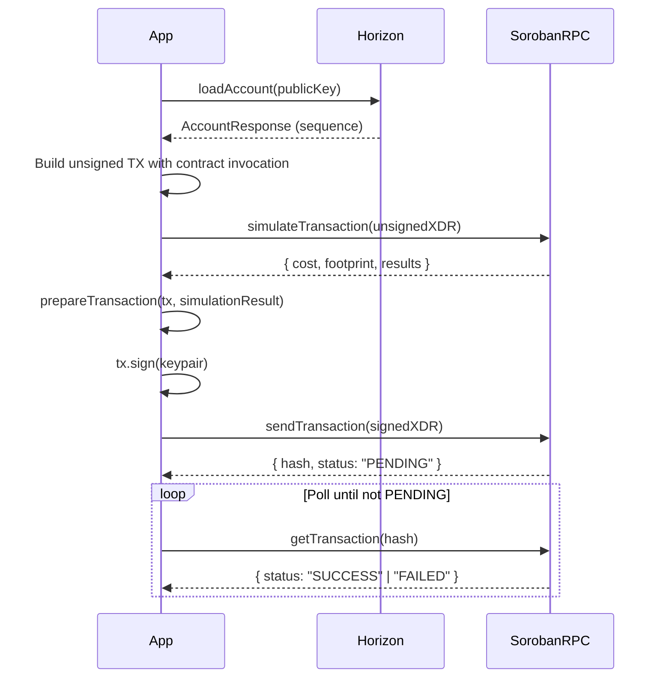

# Soroban RPC

Soroban is Stellar's smart contract platform. Contracts are written in Rust and compiled to WASM. The Soroban RPC is a **JSON-RPC 2.0** service that lets you simulate, submit, and query contract state.

## Base URLs

| Network | URL |
|---|---|
| Testnet | `https://soroban-testnet.stellar.org` |
| Mainnet | `https://soroban-rpc.stellar.org` |

## Request format

Every Soroban RPC call is a `POST` to the base URL with a JSON body:

```json
{
  "jsonrpc": "2.0",
  "id": "unique-request-id",
  "method": "methodName",
  "params": { ... }
}
```

## Available methods

| Method | Description |
|---|---|
| [`simulateTransaction`](./simulate-transaction) | Dry-run a transaction — get fee estimate, footprint, and result |
| [`sendTransaction`](./send-transaction) | Submit a signed transaction asynchronously |
| [`getTransaction`](./get-transaction) | Poll for transaction status by hash |
| [`getContractData`](./get-contract-data) | Read contract storage entries |
| [`getEvents`](./get-events) | Query contract-emitted events |
| `getLatestLedger` | Get the latest ledger info |
| `getNetwork` | Get network passphrase and protocol version |

## Typical contract invocation flow



## Error codes

| Code | Type | Description |
|---|---|---|
| `-32600` | Invalid Request | Malformed JSON-RPC request |
| `-32601` | Method Not Found | Unknown method name |
| `-32602` | Invalid Params | Wrong parameters (e.g. bad XDR) |
| `-32603` | Internal Error | Server-side error |
| `-32001` | Action Failed | The requested action could not complete |
| `-32002` | Contract Code Malformed | WASM bytecode failed verification |
