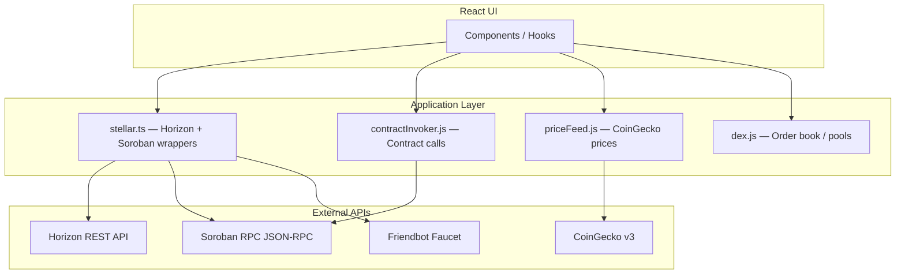

# Stellar Dev Dashboard — API Documentation

Welcome to the **Stellar Dev Dashboard** API documentation. This site covers every integration point used by the dashboard — from Horizon REST queries to Soroban smart-contract invocations — with copy-paste examples in JavaScript, TypeScript, and Python.

## What this dashboard does

The Stellar Dev Dashboard is a real-time developer tool for the Stellar network. It lets you:

- Monitor account balances, transactions, and operations live
- Invoke and simulate Soroban smart contracts
- Trade on the Stellar DEX and inspect liquidity pools
- Manage multi-operation transactions with a visual builder
- Set alert rules and receive notifications on account events
- Track portfolio analytics and price feeds

## API layers

## Quick links

| Where to go | What you'll find |
|---|---|
| [Quick Start](./quick-start) | Get your first API call running in 5 minutes |
| [API Reference](/docs/api-reference/overview) | All endpoints, parameters, and response shapes |
| [Code Examples](/docs/examples/overview) | Copy-paste ready JS, TS, and Python snippets |
| [Interactive Explorer](/docs/api-explorer) | Test live endpoints directly from the browser |
| [Error Reference](/docs/api-reference/error-reference) | Every error code and how to recover |
| [Rate Limiting](/docs/api-reference/rate-limiting) | Request limits, queuing, and throttle modes |
| [Guides](/docs/guides/getting-started-guide) | Step-by-step tutorials for common workflows |

## Networks

| Network | Horizon | Soroban RPC |
|---|---|---|
| **Testnet** | `https://horizon-testnet.stellar.org` | `https://soroban-testnet.stellar.org` |
| **Mainnet** | `https://horizon.stellar.org` | `https://soroban-rpc.stellar.org` |
| **Futurenet** | `https://horizon-futurenet.stellar.org` | `https://rpc-futurenet.stellar.org` |
| **Local** | `http://localhost:8000` | `http://localhost:8000` |

:::tip Testnet first
Always develop against Testnet. Use [Friendbot](https://friendbot.stellar.org) to fund test accounts with 10,000 XLM instantly.
:::
